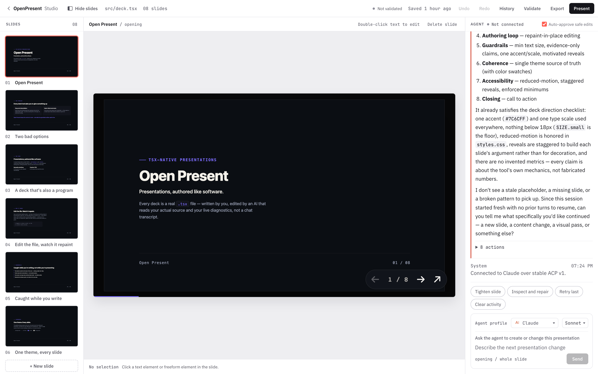

<div align="center">

# OpenPresent

### Everyone makes slides with AI now. Nothing checks them.

Your agent writes real React slides on your machine. A validator catches the
12px legend, the overlapping element, and the text running off the stage,
**before your audience does.**

[](https://www.npmjs.com/package/@openpresent/cli)
[](https://github.com/vamgan/openpresent/actions/workflows/ci.yml)
[](LICENSE)
[](package.json)
[](https://vamgan.github.io/openpresent/)

```bash
npx -y @openpresent/cli studio --open
```

</div>



---

## The 30 second version

Ask any model for a deck and you get a wall of HTML. It looks convincing in the
chat window and falls apart on a projector, because **the model never sees what
it made.**

OpenPresent closes that loop:

```
model.tiny-text  warning  [charts]  Legend text renders at 13px on the logical stage.
                          Fix: raise to at least 18px so it survives projection.
```

The agent reads that, fixes it, and checks again. No human relaying the problem.

## Why AI decks keep coming out unprofessional

HTML won for good reasons. PowerPoint is zipped XML driving an opaque layout
engine, so a model writes it blind, while HTML is the language models write best
and the browser runs everywhere. The whole industry converged on it in about a
year, and inherited the same four problems.

| | |
|---|---|
| **Every deck is a one-off** | Keyboard nav, scaling, fullscreen, reduced motion, deep links: reimplemented badly or skipped, once per deck, forever. |
| **Quality is a coin flip** | No shared primitives, so output swings with the wording of the prompt. Two decks from one company look unrelated. |
| **Nothing says it went wrong** | 12px labels and overlapping elements ship because no part of the loop ever objects. |
| **The output is a dead end** | One generated file is not something you edit next quarter. You regenerate and hope. |

## What you get

**A workspace you and your agent share.** Click any element to select it,
double-click text to edit it. Edits repaint the slide without reloading, so you
keep your place.

**Your agent, your model.** Codex, Claude, Gemini, or Kiro, whichever you
already have signed in. Pick the model per presentation. Each deck remembers its
own conversation and resumes it when you come back.

**Approvals you control.** Safe in-project edits apply automatically.
Destructive ones always ask. Anything reaching outside the folder is refused,
not prompted.

**Undo that reads like actions.** "Added metric slide". "Agent: tightened the
opening". Step back through it, or jump to any earlier point.

**One file out.** Export a self-contained HTML document you choose the location
for. No folder of assets to keep beside it.

## Your slides are yours

A presentation is a folder in your Documents, not a project you maintain:

```
~/Documents/OpenPresent/q3-review/
  index.html
  src/deck.tsx      ← your slides
  src/styles.css
```

No `package.json`, no lockfile, no `node_modules`. Studio supplies React and the
build, so your agent never burns its first turn running installs, and you can
move, copy, email, or version the folder like any other document.

And it is readable React, so you are never locked out of your own deck:

```tsx
<Slide id="evidence" title="The evidence" transition="slide">
  <h2>Three signals</h2>
  <Grid columns={3}>
    <Metric value="3×" label="Faster to review" detail="Median across 40 decks." />
    <Metric value="0" label="Cloud dependencies" />
    <Metric value="18px" label="Minimum body text" detail="Enforced, not hoped for." />
  </Grid>
</Slide>
```

Use a primitive when the pattern repeats. Use plain HTML when the slide is
specific to your story. Both are first-class.

## Plug it into your agent

OpenPresent ships an MCP server. Point your agent at it and the server starts
Studio locally and hands over the authoring loop as tools.

```json
{
  "mcpServers": {
    "openpresent": {
      "command": "npx",
      "args": ["-y", "@openpresent/mcp", "--project", "~/Documents/OpenPresent/q3-review", "--open"]
    }
  }
}
```

| Tool | What it does |
|---|---|
| `get_state`, `get_outline`, `get_selection` | Read the deck, the active slide, and the current selection. |
| `apply_edit` | Guarded source edits: exact match, single occurrence, checkpointed. |
| `insert_slide`, `list_slide_templates` | Add one slide or many, with the imports they need. |
| `validate_deck` | Run the checks, get findings back as structured data. |
| `capture_slide` | Screenshot a slide so the model can look at its own work. |
| `undo`, `redo` | Every change is reversible, by the agent or by you. |

## Taste, installed alongside the tools

Tools let an agent change a deck. They do not tell it what a good deck is. That
ships as a skill you install into the presentation, so the direction travels
with the work instead of living in someone's prompt.

Install it wherever your agent already looks for skills:

```bash
npx -y @openpresent/skills claude        # .claude/skills in this project
npx -y @openpresent/skills claude-user   # every project on this machine
npx -y @openpresent/skills agents        # .agents/skills, for Codex and similar
npx -y @openpresent/skills gpt           # plain files to upload to a GPT
```

Or scaffold a presentation with it already in place:

```bash
openpresent studio ./my-deck --create --skill deck-direction --open
```

It lands as a plain Markdown file your agent reads. Edit it, or replace it with
your own house style.

## Validation is the point

```bash
openpresent validate src/deck.tsx
openpresent validate http://127.0.0.1:4173 --min-font-size 18
```

Every finding carries a rule ID, a severity, the slide, a plain-language
message, and a repair hint. It catches text below a readable size, elements off
the canvas or overlapping, missing alt text, unreachable controls, and malformed
structured data.

## Architecture

```
deck.tsx  ─────────────────────────────────►  a document you own

@openpresent/core         theme, scale, navigation, transitions
@openpresent/components   editorial and technical primitives
@openpresent/validator    model rules + browser DOM rules
@openpresent/studio       local workspace, agent connectors, library
@openpresent/mcp          the authoring loop as agent tools
@openpresent/cli          create, dev, build, validate, studio
```

Packages flow one way: components depend on core, cli on validator. The runtime
never depends on the component library. Details in
[docs/architecture.md](docs/architecture.md).

All seven are on npm:
[cli](https://www.npmjs.com/package/@openpresent/cli) ·
[core](https://www.npmjs.com/package/@openpresent/core) ·
[components](https://www.npmjs.com/package/@openpresent/components) ·
[validator](https://www.npmjs.com/package/@openpresent/validator) ·
[studio](https://www.npmjs.com/package/@openpresent/studio) ·
[mcp](https://www.npmjs.com/package/@openpresent/mcp) ·
[skills](https://www.npmjs.com/package/@openpresent/skills)

## Development

```bash
pnpm install
pnpm check          # typecheck, build, test, validate
pnpm test:browser   # Playwright smoke over the real Studio
```

[CONTRIBUTING.md](CONTRIBUTING.md) has the workflow. [ROADMAP.md](ROADMAP.md)
covers what is deliberately not built yet.

## License

[Functional Source License 1.1 with an MIT future grant](LICENSE).

Use it, modify it, and redistribute it freely, including inside a company. The
one thing it does not permit is shipping a competing commercial product or
service built on OpenPresent, because an enterprise edition is planned. Each
release converts to the MIT License two years after it is published.
